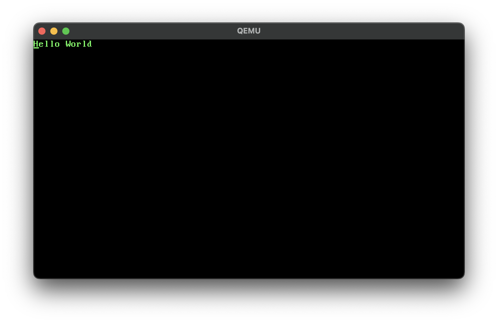

Welcome to my _new blog_ about learning Astro! Here, I will share my learning
journey as I build a new website.

## What I've accomplished

1. **Installing Astro**: First, I created a new Astro project and set up my
   online accounts.

2. **Making Pages**: I then learned how to make pages by creating new `.astro`
   files and placing them in the `src/pages/` folder.

3. **Making Blog Posts**: This is my first blog post! I now have Astro pages
   and Markdown posts!

## What's next

I will finish the Astro tutorial, and then keep adding more posts. Watch this
space for more to come.
